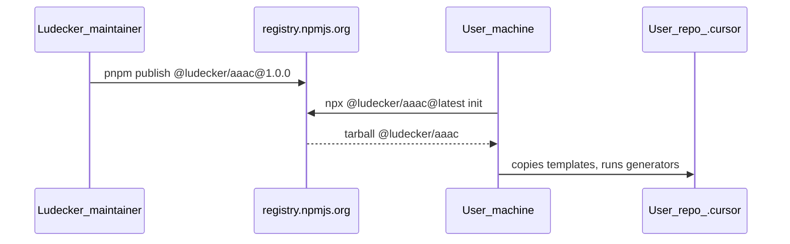
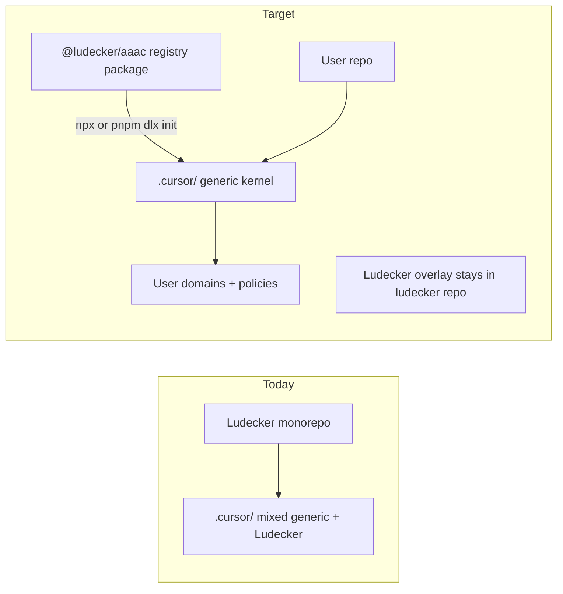

# Publish `@ludecker/aaac` — Generic Agentic Architecture Framework

## Goal

Ship the world's first installable, complete **Agentic Architecture as Code (AAAC)** framework for Cursor users:

```bash
npx @ludecker/aaac@latest init
# or (pnpm-native, same result)
pnpm dlx @ludecker/aaac@latest init
```

**Tooling policy (security):** The `npm` CLI is **not allowed** anywhere in this workflow — not for install, publish, login, or CI. Use **`npx`** or **`pnpm dlx`** for one-shot installs, and **`pnpm publish`** for releases. The package may live on the public registry, but only pnpm/npx touch it.

Users get the full generic kernel (ontology, 96-command matrix, shared pipeline skills, agents, generators, policies). They add project-specific **domains** manually afterward. Lüdecker remains the reference implementation with its `cms` / `ui` / `database` overlay.

---

## Distribution model — where the package lives vs where `npx` loads from

**Important distinction:** banning the `npm` **CLI** does not mean avoiding the public **registry**. The registry is just artifact storage; `npx` and `pnpm dlx` are separate clients that download from it.

| Layer | What | Where |
|-------|------|-------|
| **Package artifact** | `@ludecker/aaac` tarball (CLI + templates) | **Public npm registry** — default `https://registry.npmjs.org` |
| **Publish** | Maintainer ships a version | `pnpm publish` from Lüdecker monorepo → uploads to registry |
| **User install** | One-shot run, no global install | `npx` or `pnpm dlx` downloads that tarball, extracts to a temp cache, runs `aaac init`, exits |
| **Website** | Install guide + positioning | **ludecker.com** (Render) — documentation only; does **not** host the package |
| **Lüdecker repo** | Source + reference overlay | GitHub — dogfooding; not what end users clone for AAAC |



### What happens when a user runs `npx @ludecker/aaac@latest init`

1. **Resolve:** `npx` queries the configured registry (default `registry.npmjs.org`) for package `@ludecker/aaac`, tag `latest`.
2. **Download:** Fetches the published tarball (contains `src/cli.mjs`, `templates/cursor/**`, generators).
3. **Cache:** Stores under the user’s npm/pnpm cache (e.g. `~/.npm/_npx/` or pnpm store) — ephemeral for one-shot runs.
4. **Execute:** Runs the `aaac` bin → `init` copies templates into the **current project’s** `.cursor/` and `docs/` — nothing is installed globally.
5. **Done:** User’s project now has local files; no ongoing dependency on the registry until they re-run `npx`/`dlx` for upgrades.

`pnpm dlx @ludecker/aaac@latest init` does the same thing via pnpm’s store instead of npx’s cache.

### What is *not* deployed

- **Not on Render** — the website does not serve the CLI; it only links to the install command.
- **Not cloned from GitHub** — users do not need the Lüdecker monorepo (fallback tarball from GitHub releases is contingency only).
- **Not a Cursor Marketplace plugin** — AAAC installs as files under `.cursor/` in the user’s repo.

### Web URLs (once published)

| Purpose | URL | Notes |
|---------|-----|-------|
| **Package page (human)** | [https://www.npmjs.com/package/@ludecker/aaac](https://www.npmjs.com/package/@ludecker/aaac) | Version history, readme, install command — primary “find it on the web” link |
| **Registry metadata (machine)** | [https://registry.npmjs.org/@ludecker/aaac](https://registry.npmjs.org/@ludecker/aaac) | JSON versions/dist-tags; what `npx` / `pnpm dlx` query |
| **Install guide (Lüdecker)** | [https://ludecker.com/guide/install-aaac](https://ludecker.com/guide/install-aaac) | Step-by-step walkthrough; created in Phase 5 via CMS |
| **Guides index** | [https://ludecker.com/guide](https://ludecker.com/guide) | Section listing; install guide appears here |
| **Site home** | [https://ludecker.com](https://ludecker.com) | Positioning only (optional one-line AAAC mention) |

**Not a web URL users visit for install:** the CLI runs locally after `npx`/`pnpm dlx` fetches from the registry. **Source code** lives in the Lüdecker GitHub repo (`packages/aaac/`) — optional link in README, not the install path.

Scoped public package requires `@ludecker` org on the registry; publish auth is configured in `.npmrc` and used by **pnpm only** (e.g. `//registry.npmjs.org/:_authToken=...`).

---

## Current state

| What exists | Gap |
|-------------|-----|
| Full AAAC stack in [`.cursor/aaac/`](.cursor/aaac/), [`.cursor/skills/shared/`](.cursor/skills/shared/), [`.cursor/agents/`](.cursor/agents/) | No published package, no installer |
| Docs in [`docs/agentic_architecture.md`](docs/agentic_architecture.md) | Lüdecker-specific domains; not installable |
| Generators in [`generate-graph.mjs`](.cursor/aaac/generate-graph.mjs) | ~300 lines of **Lüdecker-only** static YAML (resolvers, cms/ui/database orchestrators, `release-render`, `write-article`) baked into generator |
| Website CMS | No published install guide; [`SITE_CONFIG`](apps/website/lib/constants.ts) still "Writing on design, technology, and practice." |



---

## Architecture: generic kernel vs project overlay

**Generic package ships:**

- [`.cursor/aaac/`](.cursor/aaac/) core: `dispatch.md`, `layers.md`, `contract-schema.md`, `lifecycle/`, `governance/`, `run/`, starter `contracts/`, generic `ontology.json`, generic `capabilities/registry.json`, generic `dependencies.yaml` (empty graph), generic `fitness-functions.yaml`
- [`.cursor/skills/shared/`](.cursor/skills/shared/) — all ~60 pipeline + verb orchestrator + object skills
- [`.cursor/agents/`](.cursor/agents/) — 13 generic agents (exclude [`release-render.md`](.cursor/agents/release-render.md))
- [`.cursor/policies/`](.cursor/policies/) — templates with `{{PROJECT_DOCS}}` placeholders
- [`docs/agentic_architecture.md`](docs/agentic_architecture.md) — generic Part 1 + maintainer appendix (no Lüdecker domain table)

**Stays Lüdecker-only (not in package):**

- [`domains/cms|ui|database/`](.cursor/domains/)
- [`skills/ludecker/`](.cursor/skills/ludecker/), [`skills/write-article/`](.cursor/skills/write-article/)
- [`rules/deploy.mdc`](.cursor/rules/deploy.mdc), [`rules/supabase-mcp.mdc`](.cursor/rules/supabase-mcp.mdc)
- Manual commands [`launch-ludecker.md`](.cursor/commands/launch-ludecker.md), [`kill-ludecker.md`](.cursor/commands/kill-ludecker.md)
- Lüdecker `command_overrides` entries: slug resolvers, `write-article`, `ship-ludecker`, `release-platform`

**Generic `ontology.json` overrides** (replace Lüdecker resolvers):

- Keep: `update-architecture` → `update-doc`, `review-module`, `review-incident`, `test-function`, `release-app`, generic `command_aliases`
- Remove: slug resolvers (`update-module-by-slug`, etc.), `write-article`, Lüdecker ship aliases
- `fix-bug` routes to `verb-fix` + object `feature` by default (existing fallback in [`generate-commands.mjs`](.cursor/aaac/generate-commands.mjs))

---

## Phase 1 — Refactor generators for overlays

**Problem:** [`generate-graph.mjs`](.cursor/aaac/generate-graph.mjs) lines 241–541 embed Lüdecker wiring inline.

**Fix:** Extract project wiring to a separate file both Lüdecker and consumers maintain:

```
.cursor/aaac/graph.project.yaml   # resolvers, orchestrators, skills, agents, policies
```

Generator changes:

1. Move shared logic to [`packages/aaac/src/generators/`](packages/aaac/) (`generate-graph.mjs`, `generate-graph-commands.mjs`, `generate-commands.mjs`)
2. `generate-graph.mjs` reads `ontology.json` + `graph.project.yaml` → writes `graph.yaml`
3. `generate-commands.mjs` accepts `--keep-extra` flag or reads `graph.project.yaml` `manual_commands` list (replaces hardcoded `launch-ludecker.md` / `kill-ludecker.md`)
4. Lüdecker's [`graph.project.yaml`](.cursor/aaac/graph.project.yaml) contains current static tail (cms/ui/database, write-article, release-render)
5. Generic template ships minimal [`graph.project.yaml`](packages/aaac/templates/cursor/aaac/graph.project.yaml): verb orchestrators + exception orchestrators (`update-doc`, `review-module`, `review-incident`, `test-function`, `release-app`) only

Lüdecker continues to run:

```bash
node packages/aaac/src/generators/generate-graph.mjs --root .cursor
node packages/aaac/src/generators/generate-commands.mjs --root .cursor
```

(Thin wrappers or root `package.json` script `aaac:generate`.)

---

## Phase 2 — Create `packages/aaac`

New workspace package: [`packages/aaac/package.json`](packages/aaac/package.json)

```json
{
  "name": "@ludecker/aaac",
  "version": "1.0.0",
  "type": "module",
  "bin": { "aaac": "./src/cli.mjs" },
  "files": ["src/", "templates/"],
  "engines": { "node": ">=18" }
}
```

Add `"packages/*"` already in [`pnpm-workspace.yaml`](pnpm-workspace.yaml) — no workspace change needed.

### CLI (`src/cli.mjs`)

| Command | Behavior |
|---------|----------|
| `init` | Default when no subcommand |
| `--yes` | Non-interactive defaults |
| `--dir <path>` | Target directory (default: cwd) |

**`init` flow:**

1. Guard: refuse if `.cursor/aaac/` already exists (offer `--force` to merge/backup)
2. Prompt (minimal): project name, path to architecture docs (default `docs/`)
3. Copy `templates/cursor/**` → `<target>/.cursor/`
4. Copy `templates/docs/agentic_architecture.md` → `<target>/docs/`
5. Substitute `{{PROJECT_NAME}}`, `{{DOCS_ROOT}}` in policies + docs
6. Run generators against target `.cursor/`
7. Print next steps: open Cursor, try `/review-architecture`, read maintainer appendix for adding domains

Dependencies: zero runtime deps (Node built-ins only); optional `prompts` package only if interactive UX needs it — prefer zero-dep readline for v1.

### Templates layout

```
packages/aaac/templates/
  cursor/
    aaac/          # generic ontology, graph.project.yaml, lifecycle, run, etc.
    skills/shared/ # copied from current .cursor/skills/shared/
    agents/        # 13 generic agent specs
    policies/      # templated
    contracts/     # starter set from .cursor/aaac/contracts/
  docs/
    agentic_architecture.md  # generic version
```

---

## Phase 3 — Lüdecker dogfoods the package

1. Add `@ludecker/aaac` as workspace devDependency in root [`package.json`](package.json)
2. Extract Lüdecker overlay into [`.cursor/aaac/graph.project.yaml`](.cursor/aaac/graph.project.yaml) + Lüdecker [`ontology.json`](.cursor/aaac/ontology.json) overrides (keep Lüdecker-specific `command_overrides` in repo copy, not in package template)
3. Replace in-repo generator scripts with package generators + `aaac:generate` script
4. Verify regeneration produces identical `graph.yaml` + commands (diff check before/after refactor)
5. Keep Lüdecker [`docs/agentic_architecture.md`](docs/agentic_architecture.md) as project doc (Lüdecker domains section); generic doc lives in package templates

---

## Phase 4 — Publish via pnpm (no npm CLI)

**Prerequisites (manual, outside code):**

- `@ludecker` scope on the public registry (authenticate via pnpm, not `npm login`)
- Add publish token to GitHub secrets for CI (e.g. `NPM_TOKEN` / registry token — consumed by **pnpm**, never by `npm` CLI)

**Publish steps (pnpm only):**

```bash
pnpm --filter @ludecker/aaac publish --access public
git tag aaac-v1.0.0
```

**Forbidden:** `npm publish`, `npm install`, `npm login`, `npx npm-*`, or any CI step invoking the `npm` binary.

**Optional CI** (`.github/workflows/publish-aaac.yml`): on tag `aaac-v*`, run `pnpm publish` with registry token. Use `pnpm/action-setup` + cached store; do not install or invoke npm.

**README** in package: one-liner, both install commands (`npx` + `pnpm dlx`), explicit note that npm CLI is not required, link to [ludecker.com guide](https://ludecker.com) (once published).

---

## Phase 5 — Website: install guide (single AAAC touchpoint)

Per your preference, AAAC stays primarily in **one guide** — not a site-wide rebrand.

**Publish via existing CMS flow** ([`write-article`](.cursor/commands/write-article.md) → `pnpm cms:persist`):

| Field | Value |
|-------|-------|
| Type | `guides` |
| Slug | `install-aaac` (or update existing AAAC guide if already in Supabase) |
| Title | Install AAAC in your Cursor project |

**Guide structure** (per [`.cursor/skills/write-article/frameworks/guides.md`](.cursor/skills/write-article/frameworks/guides.md)):

- **G1 Setup:** prerequisites (Node 18+, pnpm or npx available, Cursor, git repo) — **do not** instruct readers to run `npm install -g`
- **G2 Install:** primary `npx @ludecker/aaac@latest init`; alternative `pnpm dlx @ludecker/aaac@latest init`; flags (`--yes`, `--dir`)
- **G3 Verify:** open Cursor → run `/check-architecture` or `/review-module`
- **G4 Next:** link to maintainer appendix — adding first domain (`domains/<slug>/update/orchestrator` + inventory)
- **R: Sources:** package registry page (`@ludecker/aaac`), Cursor docs, `docs/agentic_architecture.md` concepts

**Light positioning tweak** (optional, one line): update [`SITE_CONFIG.description`](apps/website/lib/constants.ts) and [`FALLBACK_HOME.excerpt`](apps/website/lib/content/fallback.ts) to mention AAAC as the agentic architecture framework Lüdecker implements — without expanding AAAC content across the site.

---

## Phase 6 — Post-install maintainer path (documented, not automated in v1)

Generic users add domains by following the maintainer appendix:

1. Create `.cursor/domains/<slug>/update/orchestrator/SKILL.md` + `contract.yaml`
2. Create `.cursor/domains/<slug>/update/inventory/SKILL.md` (file map)
3. Add resolver entries to `graph.project.yaml`
4. Add `command_overrides` to `ontology.json` if slug-based routing needed
5. Re-run `npx @ludecker/aaac generate` or `pnpm dlx @ludecker/aaac generate` (add `generate` subcommand alias), or `pnpm aaac:generate` / `node` generators locally

Future v2: `aaac add-domain <slug>` wizard (out of scope per your v1 choice).

---

## Risk and mitigation

| Risk | Mitigation |
|------|------------|
| Package drifts from Lüdecker `.cursor/skills/shared/` | Lüdecker uses same generators; templates are SSOT for generic; overlay stays in Lüdecker repo |
| `init` overwrites existing `.cursor/` | Refuse by default; `--force` backs up to `.cursor.aaac-backup-<timestamp>/` |
| Users expect Lüdecker domains out of the box | Guide + generic doc clearly state "add domains"; Lüdecker is reference impl |
| `@ludecker` scope unavailable on registry | Fallback documented as `pnpm add @ludecker/aaac` (workspace dep) or GitHub release tarball — never `npm install` |
| Accidental `npm` usage in docs/CI | Lint docs and workflows; README and guide show only `npx` / `pnpm dlx` / `pnpm publish` |

---

## Success criteria

- `npx @ludecker/aaac@latest init` (or `pnpm dlx`) in an empty repo produces working `.cursor/` with ~130 generated commands
- Lüdecker regeneration unchanged after refactor (diff-clean `graph.yaml`)
- Install guide live at `/guide/install-aaac` (or equivalent); no `npm` commands in published copy
- `@ludecker/aaac@1.0.0` published via `pnpm publish`; zero `npm` CLI usage in repo docs, CI, or guide
