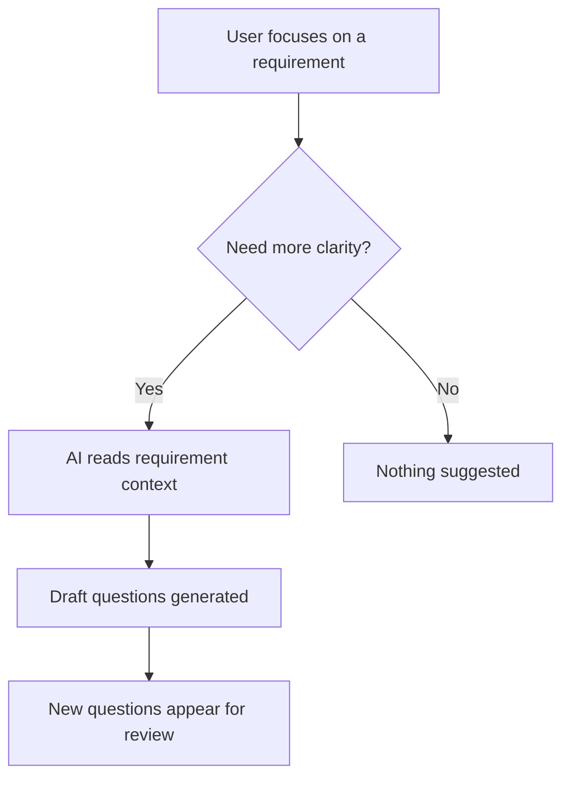

# Write Architecture Doc (Plain Language)

**Audience:** Anyone who uses or cares about the product — not developers. Product owners, designers, support, new team members, stakeholders.

**Goal:** After reading, the reader can explain *what this part of the platform does*, *why it exists*, and *how it behaves in everyday use* — without reading code.

**Mandatory:** Every architecture doc produced by `/architecture` MUST follow this guide exactly.

---

## Output Location & Naming

| Rule | Value |
|------|-------|
| Folder | `docs/` at repo root |
| Pattern | `docs/architecture_<slug>.md` |
| Slug | Lowercase, underscores, derived from module name (e.g. `Question Suggestion Engine` → `architecture_question_suggestion_engine.md`) |
| Format | Plain Markdown (`.md`), not MDX |
| Update | If the file exists, rewrite it with current facts — do not create duplicates |

---

## Required Document Structure

Use this template. **Do not skip sections.** **Do not add developer sections** (no file paths, no API tables, no code snippets except Mermaid).

```markdown
# [Human-Friendly Module Name]

> One sentence: what this is and the main benefit it gives users.

## Introduction

[2–4 short paragraphs. Plain language only.

- What problem does this solve?
- Who interacts with it (directly or indirectly)?
- Why does the platform need it?
- What would be missing if it did not exist?]

## At a Glance

| | |
|---|---|
| **Purpose** | … |
| **When it runs** | … |
| **Who notices it** | … |
| **What it produces** | … |

## How the Pieces Fit Together

[Mermaid diagram — see rules below]

## How It Works

[Numbered steps, 5–10 max. Each step = one clear action or decision in plain language.

Example tone: "When you open a requirement, the system checks whether more questions would help clarify it."

NOT: "The RequirementFocusMachine dispatches REQUEST_SUGGESTION."]

1. …
2. …
3. …

## Key Ideas

[3–6 bullets. Define terms the reader might hear in conversation — in everyday words.

Format: **Term** — plain definition]

## Common Situations

[3–5 short scenarios: "When X happens, Y occurs."

Helps the reader predict behavior. Include at least one "nothing happens" or "it waits" case if applicable.]

## Connected Parts

[Bullet list of other platform areas this module talks to or depends on — use product names, not code module names.

Example: "Requirements — needs a requirement to exist before suggesting questions"]

## Limits & Boundaries

[What this part does **not** do. Prevents wrong assumptions. 3–5 bullets.]
```

---

## Mermaid Diagram Rules

**Purpose:** Show flow and relationships so a non-technical reader can follow the story visually.

| Rule | Detail |
|------|--------|
| Type | Prefer `flowchart TD` or `flowchart LR` |
| Labels | User/product language only — "User opens requirement", "AI suggests questions", "Questions appear in list" |
| Nodes | 4–10 nodes; merge tiny steps rather than exploding detail |
| Forbidden in labels | File names, function names, HTTP verbs, database terms, acronyms without gloss |
| Direction | `TD` for timelines; `LR` for left-to-right pipelines |
| Styling | No custom colors or classes unless essential for clarity |

**Good example:**



**Bad example:** nodes like `POST /suggest/:id` or `requirementFocusMachine.ts`.

Place the diagram under `## How the Pieces Fit Together` with a one-sentence caption above it explaining what the reader is looking at.

---

## Plain Language Rules

1. **Short sentences** — average 15 words; one idea per sentence
2. **Active voice** — "The system suggests questions" not "Questions are suggested by the system"
3. **No jargon** — if a technical word is unavoidable, define it immediately in parentheses
4. **No code** — no `backticked` identifiers, paths, env vars, or stack names in body text
5. **Concrete over abstract** — describe what the user sees and what changes
6. **Honest uncertainty** — use "usually", "may", "in most cases" when behavior varies
7. **Second person sparingly** — "you" is fine for user-facing flows; "the team" for internal behavior

### Banned → Preferred

| Avoid | Use instead |
|-------|-------------|
| dispatch, invoke, persist | send, run, save |
| state machine, slice, hook | workflow, memory, automatic handler |
| endpoint, payload | request, information sent |
| dedupe, hydrate | remove duplicates, load |
| frontend / backend | app / server (only if needed) |

---

## Accuracy Rules

- Every claim must come from swarm investigation evidence — **never invent behavior**
- If the swarm could not verify something, omit it or say "Behavior may vary depending on setup"
- Prefer describing **observable outcomes** over internal mechanism guesses
- When two agents disagree, the doc writer must verify in code before stating either version

---

## Quality Checklist (before saving)

- [ ] A non-developer can read the Introduction alone and understand the purpose
- [ ] Mermaid diagram uses zero code terms in node labels
- [ ] No file paths, class names, or API routes in the document body
- [ ] "How It Works" steps match actual product behavior verified by the swarm
- [ ] "Limits & Boundaries" clarifies what this module does not do
- [ ] Filename matches `docs/architecture_<slug>.md`
- [ ] Document is self-contained — reader does not need `docs/architecture.md` first

---

## Reference Example (tone only — do not copy content)

**Introduction opening:** "The Question Suggestion Engine helps teams fill gaps in a requirement by proposing questions they might not have thought to ask. When someone is working on a requirement, the platform can automatically offer new questions based on what is already written and answered."

**Step example:** "4. If the suggested question is not already on the list, it appears alongside existing questions so the user can accept, edit, or ignore it."
