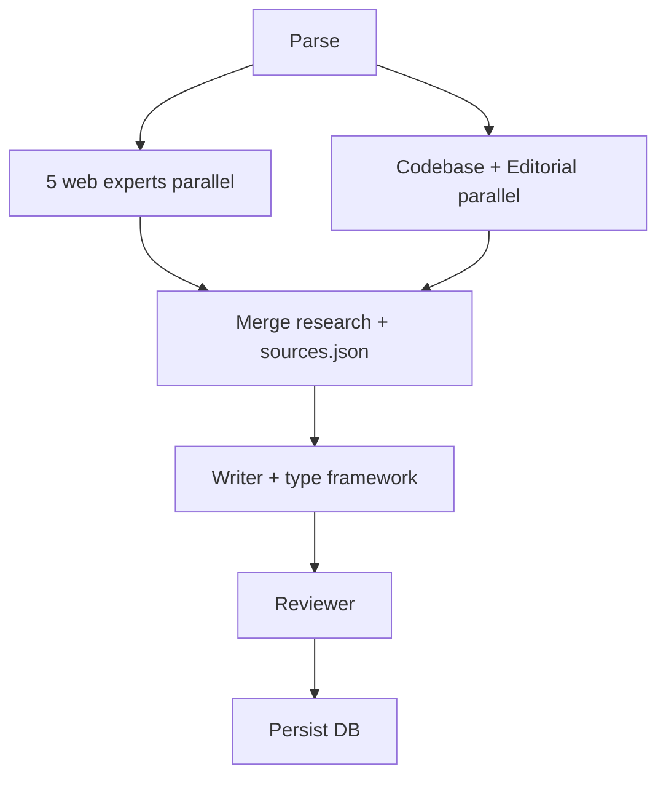

# Write Article (CMS swarm)

Produce CMS entries with **verified outbound links** and persist to Supabase. Body format: markdown — `##` headings, blank-line paragraphs, `[label](https://…)` links, optional `###` subsections, and fenced code blocks (`` ```bash ``, `` ```text ``, etc.) for commands and file trees. Use `` ```mermaid `` only for diagram articles.

**Per-type frameworks only:** [frameworks/{article_type}.md](frameworks/) — never mix guide structure into an `articles` piece. **Plain language:** every CMS body type must follow [frameworks/_voice.md](frameworks/_voice.md).

## Parse input

From `$ARGUMENTS` and the user message:

```
/write-article <type>, <title>
/write-article <type> <title>
```

| Flag | Effect |
|------|--------|
| `--publish` | `status: published` + `published_at` now (default: `draft`) |
| `--dry-run` | Full swarm; skip DB persist |
| `--update` | Upsert when `(article_type, slug)` exists |
| `--tags "a, b"` | Comma-separated tag names |

**Type aliases → `article_type`:** `article`→`articles`, `guide`→`guides`, `skill`→`skills`, `tool`→`tools`, `command`→`commands`, `subagent`→`subagents`, `diagram`→`diagrams`, **`intro`/`home`→`home`** (Introduction page at `/`, slug must be `home`).

**Important:** `article` writes to `/articles/<slug>`. It does **not** update the Introduction page. Use `intro` or `home` for that.

**Slug:** `slugify(title)`. Never commit secrets.

## SSOT

| Concern | Location |
|---------|----------|
| Types | `packages/types/src/article-type.ts` |
| Link syntax | `packages/utils/src/content-links.ts` |
| Link rendering | `packages/ui/src/ArticleInlineText.tsx` |
| Body parser | `packages/utils/src/content-body.ts` |
| Emphasis strip | `packages/utils/src/content-emphasis.ts` |
| Validation | `apps/website/lib/content/validate-form.ts` |

## Outbound links (CMS)

- Syntax: `[visible anchor](https://full-url)` inside paragraphs or under `## Sources`.
- Links open in a new tab (`rel="noopener noreferrer"`).
- **No bare URLs** in prose — always use markdown link form with human-readable anchor text.
- **No `*` or `**` emphasis** in CMS body prose (non-`skills`) — the site renders links only; asterisks appear literally.
- Cite only URLs returned by research experts or codebase paths (for repo files, still use full `https://github.com/…` links when possible).
- End with **`## Sources`** when the framework requires citations — see frameworks for minimum counts. Do not add a `Predicate form:` metadata block; `article_type`, tags, and status are CMS fields.

## Swarm pipeline



### Phase 0 — Parse (parent)

1. Resolve `article_type` from aliases; load **only** `frameworks/{article_type}.md`.
2. Compute `slug`; create `.cursor/write-article-runs/<slug>/`.

### Phase 1 — Research (7 parallel Task subagents)

**Mandatory — launch all in one message:**

| # | Agent | `subagent_type` | Spec | Output |
|---|--------|-----------------|------|--------|
| 1 | Theory | `generalPurpose` | [researchers/theory-expert.md](researchers/theory-expert.md) | `research-theory.md` |
| 2 | Practice | `generalPurpose` | [researchers/practice-expert.md](researchers/practice-expert.md) | `research-practice.md` |
| 3 | Documentation | `generalPurpose` | [researchers/documentation-expert.md](researchers/documentation-expert.md) | `research-documentation.md` |
| 4 | Current | `generalPurpose` | [researchers/current-events-expert.md](researchers/current-events-expert.md) | `research-current.md` |
| 5 | Critique | `generalPurpose` | [researchers/critique-expert.md](researchers/critique-expert.md) | `research-critique.md` |
| 6 | Codebase | `explore` | Repo patterns — **skip when `article_type` is `diagrams`** | `research-codebase.md` |
| 7 | Editorial | `explore` | `supabase/seed.sql` + DB samples for same type; tone vs [frameworks/_voice.md](frameworks/_voice.md) | `research-editorial.md` |

**`diagrams` research:** launch **5 web experts + editorial only** (6 agents). Do **not** run codebase — diagram articles are global, not repo documentation.

**Web experts (1–5):** must call **WebSearch** and/or **WebFetch**; never fabricate URLs. Pass topic, title, `article_type`, and framework path in each prompt. For `diagrams`, instruct experts: *no Lüdecker/repo content; topic is universal.*

**Parent merge** → `research.md` (synthesis) + `sources.json`:

```json
{
  "sources": [
    {
      "expert": "theory",
      "title": "",
      "url": "https://",
      "anchor": "[label](https://)",
      "useIn": "P2",
      "summary": ""
    }
  ]
}
```

Deduplicate URLs across experts. URL minimum before writing: **12** for most types; **`diagrams` uses framework minimum (5 external only)**.

### Phase 2 — Write (Task `generalPurpose`)

Inputs: `research.md`, `sources.json`, **`frameworks/{article_type}.md`**, and **`frameworks/_voice.md`**.

Output: `.cursor/write-article-runs/<slug>/draft.json`

```json
{
  "title": "",
  "slug": "",
  "excerpt": "",
  "content": "",
  "status": "draft",
  "article_type": "articles",
  "tagNames": [],
  "seo_title": "",
  "seo_description": "",
  "featured": false
}
```

Weave links naturally in argument sections; consolidate extras under `## Sources`. **Plain language first:** ~15–20 word sentences, active voice, reader-first opening, one idea per paragraph. No “In conclusion” filler.

### Phase 3 — Review (Task `generalPurpose`)

Checklist:

1. **Type-specific** [frameworks/{type}.md](frameworks/) (structure + link minimums)
2. **[frameworks/_voice.md](frameworks/_voice.md)** (plain language, sentence length, critique in body)
3. Form validation (title, slug, body)
3. `countOutboundLinks(content)` ≥ framework minimum
4. Every link matches `sources.json` or repo fact (**`diagrams`:** external URLs only — fail if any `github.com/signalbynoise/ludecker` or "Lüdecker" in body)
5. No placeholder `example.com` / `TODO` links
6. **`diagrams`:** exactly **one** mermaid fence; fail if body references this codebase or CMS
7. **`skills`:** full `SKILL.md` in `content`; `slug` === frontmatter `name`; fail if body uses legacy `C:` / `P1:` prefix lines; update `.cursor/skills/<name>/SKILL.md` when applicable
8. **No emphasis markers in prose:** FAIL if `content` contains `**` or single-asterisk emphasis outside fenced code blocks (`` ``` `` … `` ``` ``). `skills` rows are exempt.

Max **2** revision rounds. Output: `review.md` with PASS/FAIL.

### Phase 4 — Persist (parent)

```bash
node .cursor/skills/write-article/scripts/persist-content.mjs \
  --file .cursor/write-article-runs/<slug>/draft.json \
  --update \
  --publish
```

Use **`--publish`** when the piece should appear on the public site. After a successful publish, `persist-content.mjs` calls production `POST /api/revalidate` (requires `NEXT_PUBLIC_SITE_URL` and `REVALIDATE_SECRET` in `apps/website/.env.local`, matching Render).

Or Supabase MCP `execute_sql` — then trigger revalidation manually if needed. Report `getContentPublicPath(article_type, slug)`.

## Final report

Include **Research:** 5 web experts + codebase + editorial · **Outbound links:** &lt;count&gt; · **Review:** PASS/FAIL.

## Anti-patterns

- Fewer than 5 web research subagents
- **`diagrams`:** multiple mermaid fences, repo/CMS content, or running codebase researcher
- **`skills`:** essay `P1`/`P2` structure, or CMS entry that is not a copyable `SKILL.md`
- Skipping `## Sources` (when the framework requires it — not required for `skills`)
- Bare URLs or footnotes without markdown link syntax
- `**bold**` or `*italic*` in CMS body prose (non-`skills`)
- Same framework for every `article_type`
- Publishing on FAIL review
- Invented citations

## Multiple articles

**One invocation = one CMS row.** Repeat the command per title (same `article_type` is fine):

```
/write-article article, Separation of Concerns
/write-article article, Single Source of Truth
/write-article article, Explicit State Machines
```

Do **not** pass several titles in one line after the type — commas become part of a single title, not a batch list. Run pipelines sequentially; do not skip research/review per article.

## Examples

```
/write-article article, Separation of Concerns
/write-article guide, How to build Commands in Cursor
/write-article tools, The most important tools your agents need
```
