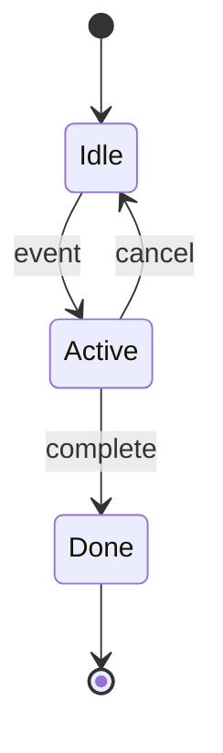

# Framework: `diagrams` only

**Global, topic-first articles.** The diagram is the product; prose only orients the reader. These are **not** Lüdecker architecture docs, **not** repo walkthroughs, and **not** CMS meta-articles unless the title explicitly asks for that.

**Voice:** follow [\_voice.md](_voice.md) — opening max three sentences; legend in everyday words.

## Scope rules (non-negotiable)

| Do | Do not |
|----|--------|
| Explain the **concept** (e.g. how state machines work) | Reference `ludecker`, this monorepo, `signalbynoise/ludecker`, or `/admin` |
| One **general** example (login flow, traffic light, order status) | Map nodes to `apps/website/…`, `master_rules.md`, or write-article pipeline |
| Link **external** canon (W3C, papers, Mermaid, library docs) | Use codebase research in the article body |
| **One** Mermaid diagram per article (default) | Multiple unrelated charts in one piece |

Exception: user title explicitly says "Lüdecker …" or "CMS …" — then a scoped diagram is allowed; default is still global.

## Mermaid format

**Exactly one** fenced block in the whole article:

```markdown
## <topic title — same as article title>

<what the concept is, one short paragraph — external links only>

<how to read the diagram top-to-bottom; states, events, one active state>

How a finite state machine moves through named states.



<legend: node and edge meanings in plain language>

<optional: limits, alternatives, or when to use — 2–4 sentences, external link>

## Sources

[External source](https://…) — …
```

Rules:

- Single ` ```mermaid ` fence — the main content of the article.
- Prefer `stateDiagram-v2` with `direction TB` for state-machine topics.
- Use `flowchart TB` for pipelines; `sequenceDiagram` for message flows.
- Node IDs: alphanumeric, no spaces in IDs (labels may have spaces in quotes).
- Rendering: `packages/ui/src/mermaid-config.ts` (dark theme only — not article subject matter).

## Outbound links

| Rule | Minimum |
|------|---------|
| Opening sections (concept + how to read) | **2** external links (spec, encyclopedia, or official docs) |
| Legend | Explain diagram symbols; **no** GitHub links to this repo |
| `## Sources` | **3** external entries only |
| Unique URLs | **5** — all off-site |

## Research swarm note

For `diagrams`, **web experts only** + **editorial** (tone/format). **Skip codebase researcher** — it must not feed the draft.

## Review checklist

- [ ] Exactly **one** mermaid fence
- [ ] Zero mentions of Lüdecker, ludecker repo paths, CMS tables, or Cursor commands
- [ ] Topic is understandable without knowing this project
- [ ] Diagram uses TB / vertical layout
- [ ] All links are external canon
